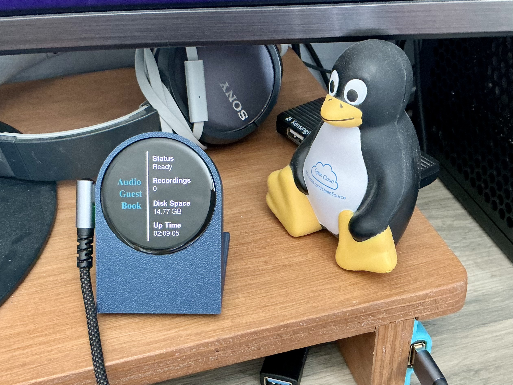
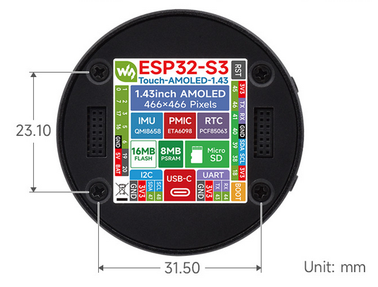
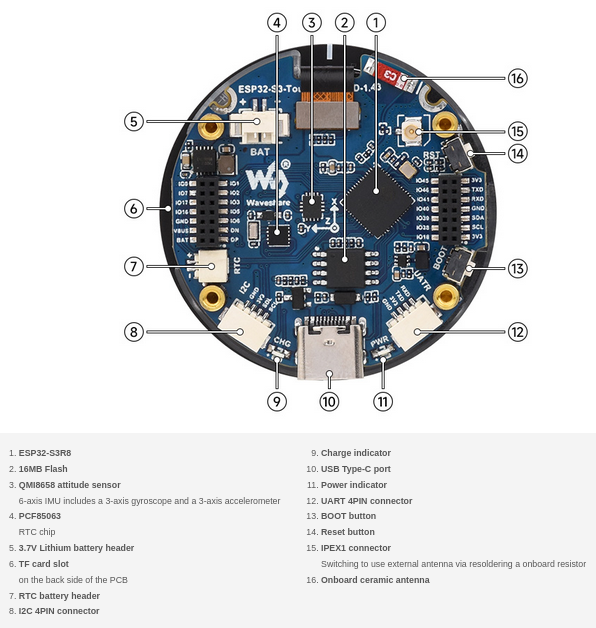
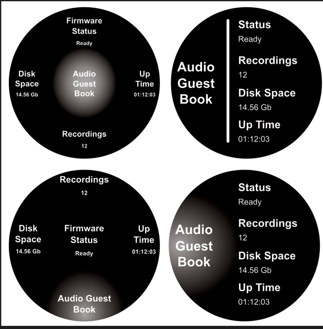

# Audio Guestbook Admin Viewer

This is a admin viewer for the audio guestbook application project which will be recording messages for the bride and groom at an upcoming family wedding.

I am using the Waveshare round AMOLED 1.43” display along with; ESP-NOW, Arduino_GFX_library & TFT_eSPI (graphics), Platformio, and VSCode for the IDE.

- Product information: https://www.waveshare.com/esp32-s3-touch-amoled-1.43.htm
- Waveshare wiki: https://www.waveshare.com/wiki/ESP32-S3-Touch-AMOLED-1.43

## Project Goals

Utilise the display to show status/up time/recordings/disk space of the audio guestbook application. I do have a webpage admin viwer (see audio-guestbook repository) but that would have meant looking at the phone all the time. With this I can put it on the table (have designed and 3D printed a stand for it) and forget about it. It will be powered by a battery pack (Anker Powercore 10,000 mAh) for the duration of the wedding.

## Hardware

- **Board:** Waveshare ESP32-S3 Touch AMOLED 1.43"
- **Display:** AMOLED (SH8601 / CO5300)
- **Touch Controller:** FT3168
- **Interface:** QSPI (display), I²C (touch)

## Pictures

<figure>
  <figcaption>Project Screenshop</figcaption>
  
</figure>

<figure>
  <figcaption>Board Connections - High Level</figcaption>
  
</figure>

<figure>
  <figcaption>Board Explanation</figcaption>
  
</figure>

<figure>
  <figcaption>Display Ideas</figcaption>
  
</figure>

## Notes

Created a esp-now-admin-server to replace the admin-viewer (see audio-guestbook repository) which uses ESP-NOW to send encrypted messages to this board only. Encryption might be over the top but it was easy to implement so why not! 

Have a working viewer now getting messages from the server every minute or when that status changes. Having problems with the touch interface at the moment. I can spam the I2C interface and get finger readings but get underlying software warnings due to changes Espressif did to their library (known problem). Would prefer to use an interrupt but currently can’t get that working from any of the examples I have found in my project :-(
